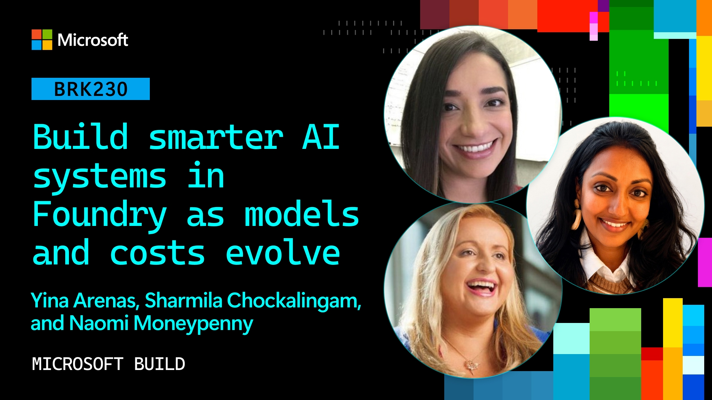
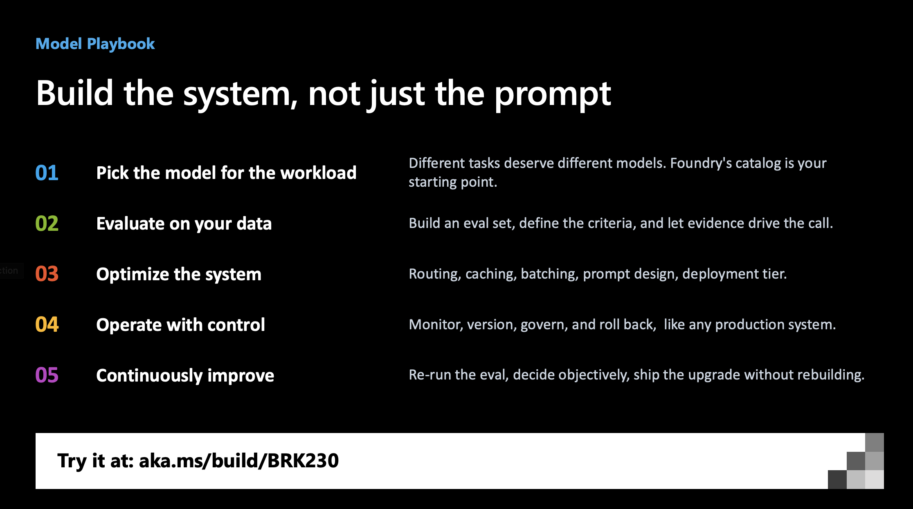
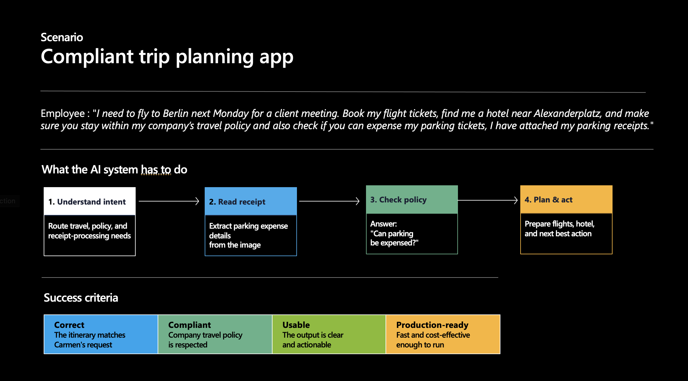

<a name="start-building"></a>
<br>
<p align="center">

</p>

# [Microsoft Build 2026](https://build.microsoft.com)

## BRK230: Build Smarter AI Systems in Foundry as Models and Costs Evolve

Discover how to quickly choose, integrate, and validate AI models inside Microsoft Foundry. Learn techniques for navigating thousands of model options, benchmarking performance, and streamlining your workflow with deep IDE support. Build faster, ship smarter, and stay on top of the evolving AI landscape.

| _Click the banner to visit the session page & watch replay_ |
|:---:|
| [](https://build.microsoft.com/en-US/sessions/brk230) |

<br/>

## Introduction

Model lifecycles are now measured in months, sometimes weeks, and production agents need to deploy and use multiple models to get the right fit for each task. _"What model should I use?"_ is the wrong question to ask. Instead, the right question is: _"How do I build an AI system that keeps getting smarter, faster, safer, and more cost-efficient as models evolve?"_

In this session, walk through the developer's workflow as they tackle that system-design problem from the initial plan to the final deployed product. By the end of the session, you should get a sense for the **model playbook** you can use to apply these levers to your own system development and scenarios.



<br/>

## Scenario: Compliant Trip Planning

_World Wide Importers_ is a fictitious enterprise company that requires its employees to travel all over the world to conduct business. They have complex travel policies that need to be taken into account when making plans and submitting expenses. So they decided to build a _Travel Concierge_, an AI assistant that can help employees handle travel planning and expenses in a compliant way.



This demo walks through that system-design problem end-to-end using **Microsoft Foundry**. We follow the travel request from an employee — decomposing it into the jobs a production agent actually has to do: routing intent, reading a receipt image, answering a policy question, planning the trip, and calling tools. For each job, we show how to pick, evaluate, route, fine-tune, and operate the right model.

<br/>

## Developer Challenges

The session is organized around four challenges every AI developer faces:

| | | |
|:---|:---|:---|
| **Select** | _Which model fits my task?_ | Browse over 11,000 models in the Foundry catalog (Azure OpenAI, Claude, MAI, DeepSeek, Mistral, Grok, Llama, Cohere, Fireworks AI, and more) and shortlist candidates|
| **Evaluate**| *Is the model getting better?*|Define quality, latency, and cost criteria, then compare models side by side on your own data with built-in and custom evaluators. |
| **Optimize**| *How do I reduce cost?*|Apply model routing, prompt caching, batch inference, provisioned throughput, structured outputs, and distillation or fine-tuning to cut cost without losing quality.|
| **Operate**| *Will it hold up in production?*| Deploy with managed endpoints, versioning, rollback, monitoring, responsible AI guardrails, and governance.|
| | |

Watch as we iterative refine our system using a series of Microsoft Foundry levers for cost, latency and quality optimization. The end result - a solution that meets our targets for lower cost and latency, and higher quality by applying playbook ideas like _decomposition_ (replace single frontier model with multi-model approach, using smaller and cheaper models that "fit" these tasks), _distillation_ (using frontier model as teacher, to transfer knowledge to a smaller, cheaper "student" without losing quality) and _custom evaluation_ (creating more tailored metrics to capture and correct domain-specific quality gaps).

<br/>

## Learning Outcomes

By the end of this session, you will be able to:

- Reframe model selection from a one-time decision into a continuous **system-design** problem with both an agent loop and a model loop.
- Decompose a user request into discrete **jobs to be done** and map each job to the right model tier (nano, mini, or frontier) instead of overusing a single frontier model.
- Build an **evaluation harness** in Foundry by defining quality, latency, and cost criteria, generating synthetic eval data, and comparing models side by side with quality, risk and safety, and agent evaluators.
- Apply the full **cost optimization stack**: model router, prompt and semantic caching, structured outputs, batch inference, provisioned throughput, and fine-tuning or distillation.
- Use **distillation** (teacher to student fine-tuning) to get frontier-quality answers at small-model cost and latency.
- **Operate** a production AI system with managed deployments, versioning, rollback, monitoring, content safety, and governance.

<br/>

### 💬 Keep Learning with Copilot

Try these prompts with GitHub Copilot to explore the topics from this session. Open Copilot Chat in Visual Studio Code (`Ctrl+Alt+I` on Windows or Linux, `Cmd+Shift+I` on Mac), paste a prompt, and see what you learn. Try connecting the [Microsoft Learn MCP Server](#-microsoft-learn-mcp-server) for the latest official documentation.

Use these as a starting point, or write your own:

- *"Explain the difference between an **agent loop** and a **model loop** in Microsoft Foundry, and when I should invest in each."*
- *"I have a multi-step agent using one frontier model for every call. Walk me through how to **decompose the workload into jobs to be done** and pick a cheaper model tier for each."*
- *"Show me how to set up an **evaluation run in Microsoft Foundry** that compares two models on quality, latency, and cost using my own dataset."*
- *"What is **knowledge distillation**, and how would I use a teacher model in Foundry to fine-tune a smaller student model for a policy Q&A task?"*
- *"Compare **prompt caching**, **semantic caching**, **batch inference**, **provisioned throughput**, and **model router** in Foundry. When should I use each one to reduce cost?"*
- *"Generate a checklist for taking an AI agent to production on Foundry that covers monitoring, versioning, rollback, content safety, and governance."*

### 💻 Technologies Used

1. **Microsoft Foundry**: the AI app and agent factory, covering Models, Agent Service, IQ, Tools, Evaluations, and the deployment and governance control plane.
1. **Foundry Models catalog**: over 11,000 models including **Azure OpenAI** (GPT-4.1, GPT-4.1-mini, GPT-4.1-nano), **Claude in Microsoft Foundry** (Opus 4.7, Sonnet 4.6, Haiku 4.5), **MAI models** (MAI-Thinking-1, MAI-Image-2.5, MAI-Code-1, MAI-Voice-2, MAI-Transcribe-1.5), **DeepSeek**, **Mistral**, **Grok**, **Llama**, **Cohere**, **Black Forest Labs**, **Fireworks AI**, **Hugging Face**, and **NVIDIA**.
1. **Foundry Evaluations**: quality, risk and safety, and agent evaluators, plus custom evaluators.
1. **Model Router**, **prompt caching**, **semantic caching**, **structured outputs**, **global batch**, **provisioned throughput (PTU)**, and **priority processing** for cost and latency optimization.
1. **Fine-tuning and distillation** workflows (SFT, DPO, RLHF) in Foundry.
1. **Responsible AI** content filters, jailbreak protections, and PII handling, with **Agent 365** for governance.

### 📚 Resources and Next Steps

| Resource | Description |
|:---------|:------------|
| [**microsoft-foundry/model-releases**](https://github.com/microsoft-foundry/model-releases) | 🧪 **Hands-on labs for every demo in this session.** Samples for Microsoft Foundry model releases, assembled into partner workshops for active skilling across model selection, evaluation, routing, and distillation. |
| [ai.azure.com](https://ai.azure.com) | Start building with Microsoft Foundry. |
| [aka.ms/ClaudeGAonFoundry](https://aka.ms/ClaudeGAonFoundry) | Claude in Microsoft Foundry: General Availability (Opus 4.7, Sonnet 4.6, Haiku 4.5). |
| [aka.ms/MAIonFoundry](https://aka.ms/MAIonFoundry) | The 9 MAI models announced at Build 2026 (Thinking, Image, Code, Voice, Transcribe). |
| [aka.ms/ai/discord](https://aka.ms/ai/discord) | Join the Microsoft AI Discord community. |
| [aka.ms/build/BRK230](https://aka.ms/build/BRK230) | Slides and recording for this session. |
| [Microsoft Foundry documentation](https://learn.microsoft.com/azure/ai-foundry/) | Official docs for models, agents, evaluations, fine-tuning, and deployment. |
| [https://aka.ms/build26-next-steps](https://aka.ms/build26-next-steps) | Explore lab and session repos to further your learning from Microsoft Build. |
| [Watch the session recording](https://aka.ms/build26/BRK230/youtube) | Watch the recorded Microsoft Build session. |

#### Related Build 2026 sessions

| Session | Title |
|:--------|:------|
| **DEM322 / DEM320** | Smaller, faster, smarter: Distilling agents with fine-tuning |
| **DEM323** | Under the hood of MAI-2 |
| **BRK241** | From prototype to production: build and run agents at scale |
| **BRK231** | Deploy. Observe. Learn. Reinforcement learning for production agents |
| **BRK252** | From observability to ROI for AI agents on any framework |
| **BRK250** | Govern open-source AI agents, any framework, any scale |
| **BRK251** | Build secure and enterprise-ready agents with Agent 365 |
| **BRK246** | Context engineering for agents: connect agents with enterprise knowledge |
| **BRK242** | Turn your agents into action: connect tools, APIs, and data |
| **BRK232** | Train and deploy custom OSS reasoning models with Foundry |


### 🌟 Microsoft Learn MCP Server

The Microsoft Learn MCP Server gives your AI agent direct access to Microsoft's official documentation, providing grounded, up-to-date answers about the products and services covered in this session.

**Visual Studio Code** one-click installation:

[](https://vscode.dev/redirect/mcp/install?name=microsoft-learn&config=%7B%22type%22%3A%22http%22%2C%22url%22%3A%22https%3A%2F%2Flearn.microsoft.com%2Fapi%2Fmcp%22%7D)


**GitHub Copilot CLI**: run this to install the Learn MCP Server as a plugin:
```
/plugin install microsoftdocs/mcp
```

For more info, other clients, and to post questions, visit the [Learn MCP Server repo](https://aka.ms/learnmcp).

## Content Owners

<!-- TODO: Add yourself as a content owner
1. Change the src in the image tag to {your github url}.png
2. Change INSERT NAME HERE to your name
3. Change the github url in the final href to your url. -->

<table>
<tr>
    <td align="center"><a href="https://github.com/yinaa">
        <br />
        <sub><b>Yina Arenas</b><br/>Corporate Vice President, Microsoft Foundry</sub></a><br />
            <a href="https://github.com/yinaarenas" title="talk">📢</a>
    </td>
    <td align="center"><a href="https://github.com/naomimoneypenny">
        <br />
        <sub><b>Naomi Moneypenny</b><br/>GPM, Foundry Models</sub></a><br />
            <a href="https://github.com/nmoneypenny" title="talk">📢</a>
    </td>
    <td align="center"><a href="https://github.com/shara131981">
        <br />
        <sub><b>Sharmila Chockalingam</b><br/>Director, AI Marketing</sub></a><br />
            <a href="https://github.com/shara131981" title="talk">📢</a>
    </td>
</tr></table>

## Contributing

This project welcomes contributions and suggestions.  Most contributions require you to agree to a
Contributor License Agreement (CLA) declaring that you have the right to, and actually do, grant us
the rights to use your contribution. For details, visit [Contributor License Agreements](https://cla.opensource.microsoft.com).

When you submit a pull request, a CLA bot will automatically determine whether you need to provide
a CLA and decorate the PR appropriately (e.g., status check, comment). Simply follow the instructions
provided by the bot. You will only need to do this once across all repos using our CLA.

This project has adopted the [Microsoft Open Source Code of Conduct](https://opensource.microsoft.com/codeofconduct/).
For more information see the [Code of Conduct FAQ](https://opensource.microsoft.com/codeofconduct/faq/) or
contact [opencode@microsoft.com](mailto:opencode@microsoft.com) with any additional questions or comments.

## Trademarks

This project may contain trademarks or logos for projects, products, or services. Authorized use of Microsoft
trademarks or logos is subject to and must follow
[Microsoft's Trademark & Brand Guidelines](https://www.microsoft.com/legal/intellectualproperty/trademarks/usage/general).
Use of Microsoft trademarks or logos in modified versions of this project must not cause confusion or imply Microsoft sponsorship.
Any use of third-party trademarks or logos are subject to those third-party's policies.
